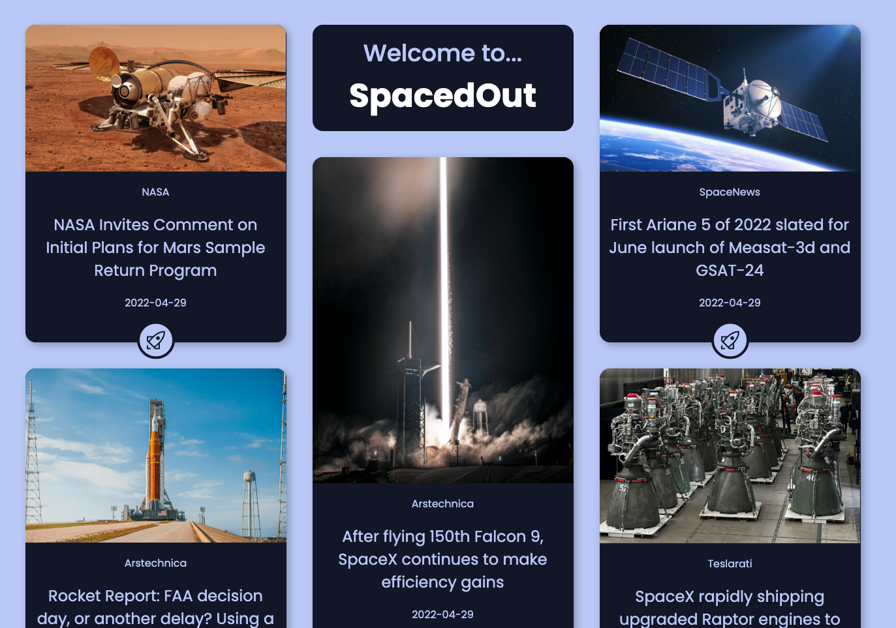

# TypeScript Space-Blog

_A screenshot of the live site._

---

## Project Overview

The goal of this task was to develop my TypeScript skills.

---

## Design Approach

I used the [SpaceFlight News API](https://spaceflightnewsapi.net/) to get data that would populate my site. The GET Request response was typed and then used to populate each card visible on the website.

A masonry styled layout was used to create several columns that fit together smoothly.

CSS hover animations were used to guide users to the button linking to the article on an external website (using the link provided by the API).

---

## Links

### Deployed Site

https://samueljacobs98.github.io/space-blog/

### GitHub Repo

https://github.com/samueljacobs98/space-blog

### Figma Design

https://www.figma.com/file/4SapCRCFnxWgdrSf0sYvxv/SpacedOut?node-id=0%3A1
